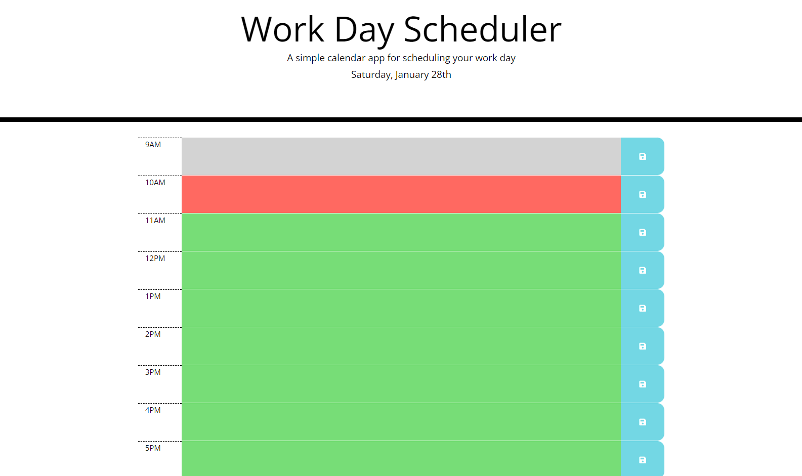
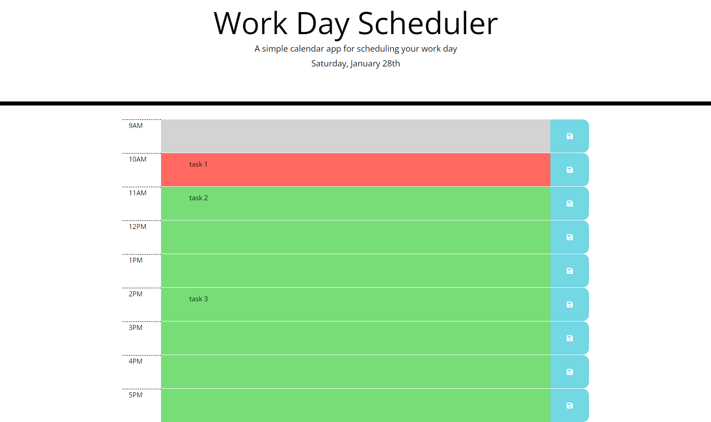

# Work Day Scheduler

## Description

A calendar application which allows users to save events for each business hour of the day. 

This app was built with jQuery and features dynamically updated HTML and CSS.

## Installation

N/A

## Usage

To access this application, go to: https://codri5.github.io/work-day-scheduler.

Enter events in the timeblocks chosen and click the save button.

## Screenshots

## Credits

N/A

## License

Please refer to the LICENSE in the repo.
